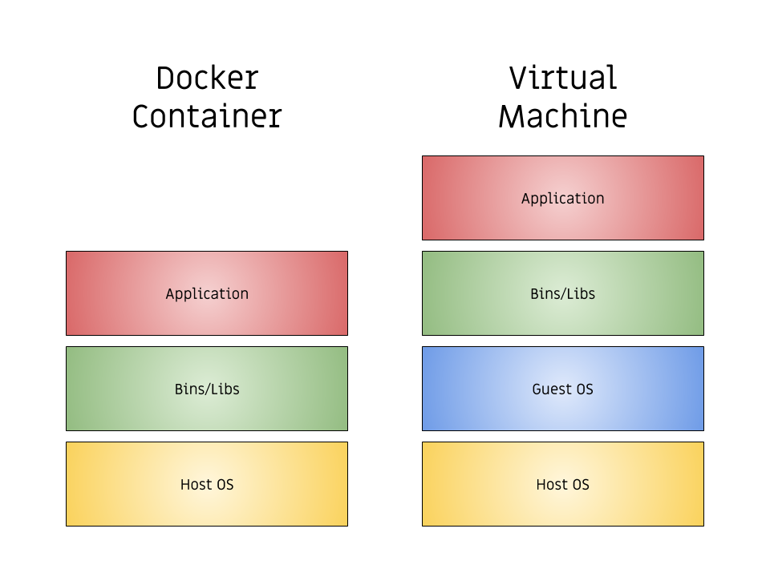

# Глава 1. Введение в Docker

С момента своего первого выпуска в 2013 году Docker стал двигателем контейнеров для многих разработчиков, и вскоре он может заменить виртуальную машину рядом с вами. Эта книга предлагает пошаговое руководство, которое проведёт вас через процесс создания реального веб-приложения на PHP с использованием Docker, объясняя основы платформы по пути.

В создаваемой в этой книге приложении будут использоваться такие ключевые возможности, которые PHP-разработчики выполняют ежедневно, включая:

* Установка зависимостей, используя [Composer](https://getcomposer.org/).
* Использование фреймворка ([SlimPHP](https://www.slimframework.com/)) для маршрутизации.
* Получение данных с стороннего API.
* Сохранение данных в базу данных.
* Безопасная настройка переменных среды.

Эта книга была написана для опытных разработчиков PHP, которые хотят научиться разрабатывать веб-приложения с помощью Docker, узнать, как работает Docker, и, как обучение, создавать реальные рабочие приложения. После того, как вы закончите эту книгу, вы будете готовы к более продвинутым темам Docker, поэтому я включил некоторые информационные ресурсы, которые помогут вам в конце.

Весь код, который я включаю в эту книгу находится в открытом доступе и [свободно доступен на GitHub](https://github.com/shiphp/weather-app). Если вы видите какие-либо проблемы или хотите предложить улучшение, не стесняйтесь создать пулреквест. Наконец, часто проверяйте на [www.shiphp.com](https://www.shiphp.com/) посты в блогах, новые обучающие материалы и книги как по Docker, так по PHP.

## Что такое Docker?

Docker — это платформа для управления и запуска контейнеров. Контейнеры похожи на [виртуальные машины](https://ru.wikipedia.org/wiki/%D0%92%D0%B8%D1%80%D1%82%D1%83%D0%B0%D0%BB%D1%8C%D0%BD%D0%B0%D1%8F_%D0%BC%D0%B0%D1%88%D0%B8%D0%BD%D0%B0), но они на самом деле не имитирует всю операционную систему. Вместо этого все контейнеры, которые вы используете, используют одно и то же основное ядро с хост-машиной, а это означает, что они намного легче, чем виртуальные машины. Из-за этого контейнеры очень эффективны, и большинство реальных приложений запускают сразу несколько контейнеров. Docker помогает связать эти контейнеры вместе с помощью контейнеров [networks](https://docs.docker.com/engine/userguide/networking/) и поможет вам определить ваши контейнеры с помощью [Docker Compose](https: // docs. docker.com/compose/). Хотя эта книга не затрагивает эти темы подробно, она поможет вам начать работу, а более углублённые материалы доступны на [www.shiphp.com](https://www.shiphp.com/).

{width=100%}

## Почему Docker?

Разработчики PHP, которые знакомы с виртуальными машинами или использовали [Vagrant](https://www.sitepoint.com/5-easy-ways-getting-started-php-vagrant/), будут легче всего понимать контейнеры, сравнивая их с виртуальными машинами. Важное отличие между контейнерами и виртуальными машинами на практике заключается в том, что вы редко используете *один-единственный* контейнер Docker для всего вашего приложения. Вместо этого вы запустите свой PHP-код в одном контейнере, веб-сервер в другом контейнере, а базу данных в третьем контейнере. Некоторые приложения, над которыми я работал, используют десятки связанных между собой контейнеров для функционирования!

Если вы раньше не использовали виртуальную машину, Docker-контейнеры могут помочь вам улучшить рабочий процесс разработки. Разработчики, которые работают с командами, которые запускают PHP и Apache изначально в своей операционной системе, часто сталкиваются с проблемой «это работает на моей машине». Один разработчик команды обновляет приложение, и все работает нормально, но затем, когда приложение развёртывается на сервере или запускается другим членом команды, оно таинственно ломается. Docker решает эти проблемы, позволяя разработчикам создавать и распространять реплицируемые (воспроизводимые) окружения для разработки, а затем *тестировать и развёртывать (деплоить) приложения в точно таком же состоянии*, используя контейнеры.

На данный момент вы можете прочитать немного больше о Docker. В то время как эта книга проведёт вас через процесс создания и запуска веб-приложения PHP на Docker, она не пытается охватить внутреннюю работу Docker, контейнеров или виртуализацию операционной системы. Вы можете прочитать больше о Docker и много связанных с ним тем на [сайте Docker](https://www.docker.com/what-docker).

## Что я могу ожидать от этой книги?

Хотя компьютерная наука за контейнерами — интересная тема, эта книга использует прагматичный подход. Многие PHP-разработчики (включая меня) — самоучки, поэтому я написал эту книгу, чтобы *помочь тем, кто обучается в ходе практической деятельности*. На этом пути для лучшего понимания я включил несколько диаграмм, а также примеры кода (вместе с [завершённым кодом в репозитории на GitHub] (https://github.com/shiphp/weather-app)) и ссылки на бесплатные и платные ресурсы, чтобы узнать больше о каждой из затронутых тем.

Чтение документации по [Docker](https://docs.docker.com/) — хорошая идея, но я считаю, что начало работы с рабочим приложением даёт мне лучший контекст для документации и углубляет моё понимание того, что я там читаю. Если вы разработчик PHP, в этой книге вы отправитесь в путешествие, чтобы создать своё первое приложение и дать вам тот фундамент, который вам нужно по-настоящему понять, как работает Docker, и как вы можете использовать его для созданиялучшего программного обеспечения.

Приложение, которое мы создаём в этой книге, является простым [REST](https://stackoverflow.com/questions/671118/what-exactly-is-restful-programming) API, но оно охватывает большинство типичных проблем, которые потребуется решать PHP-разработчикам при использовании Docker. На протяжении всего процесса создания этого приложения я покажу вам установку пакетов с помощью [Composer](https://getcomposer.org/), получение данных из стороннего API, сохранение данных в базе данных и использование переменных окружения с помощью Docker. Вместо того, чтобы объяснять все прямо сейчас, большинство подробностей будут раскрыто при создании приложения.

Лучшим способом прочитать эту книгу было бы сесть с ней и компьютером после обеда и проработать её. Надеюсь, к концу вы будете готовы начать использовать Docker для своего следующего проекта PHP.

В этой книге есть несколько предпосылок. У вас должно быть понимание [того, что такое PHP](http://php.net/manual/ru/intro-whatis.php) и основы его синтаксиса, вы должны знать, как открыть терминал на вашем компьютере и запускать PHP-скрипты из-под консоли, и у вас должна быть версия 17 общедоступной (community) версии [Docker (доступно для Mac, Windows или Linux)] (https://www.docker.com/community-edition), установленной на вашем компьютере. Предполагая, что у вас всё это есть, давайте начнём!